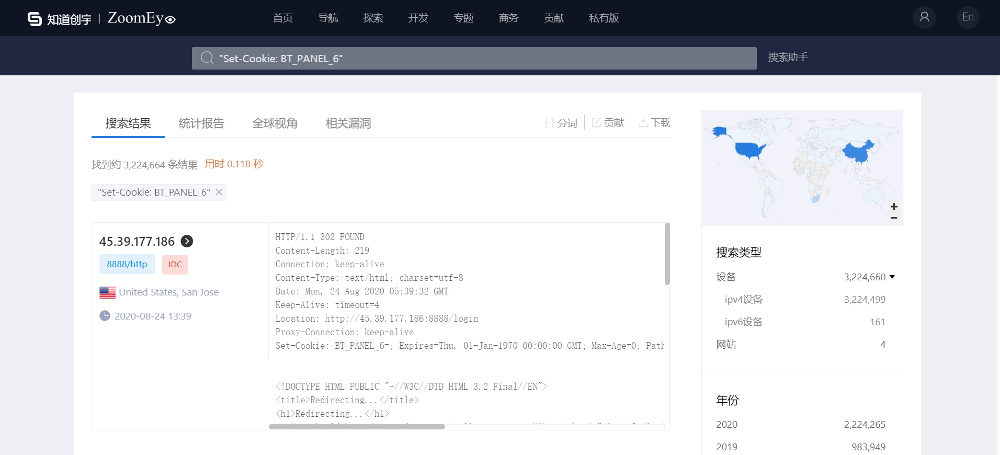

### 宝塔linux未授权访问phpMyAdmin

dork："Set-Cookie: BT_PANEL_6"

使用pocsuite3编写的无害检测脚本[BT_UNAuth_Access_PHPMyAdmin.py](https://github.com/YIGEBEACH/BT-UNAUTH-Access-PHPMyAdmin/blob/master/BT_UNAuth_Access_PHPMyAdmin.py)，检测成功率约为：

8516/3224664 = 0.264%